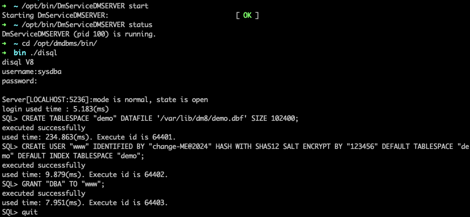
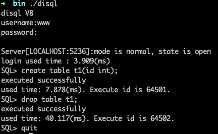
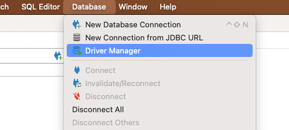
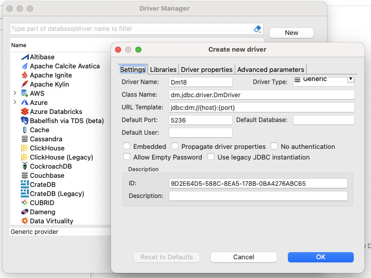
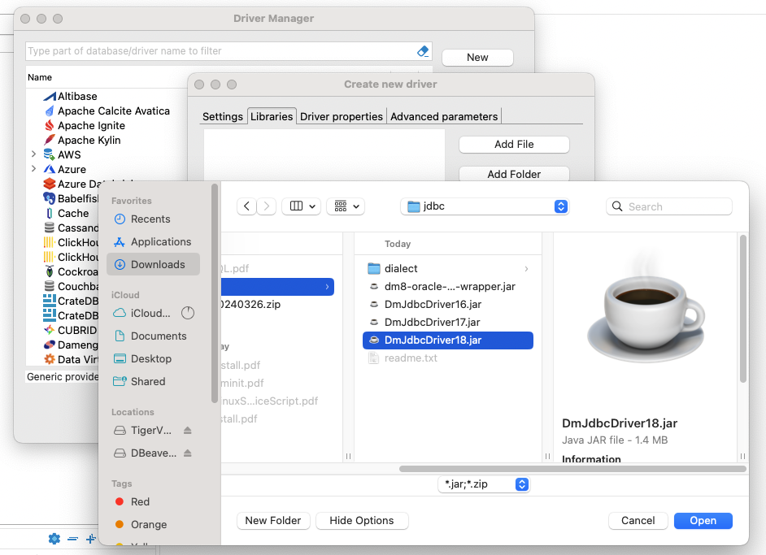
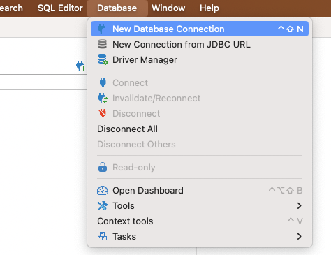
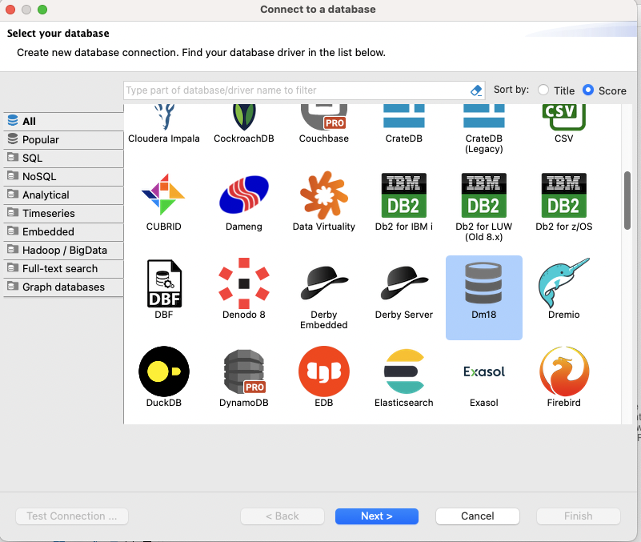
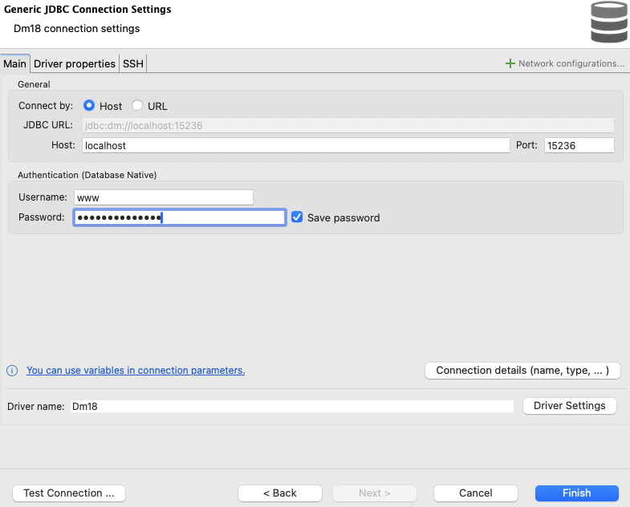
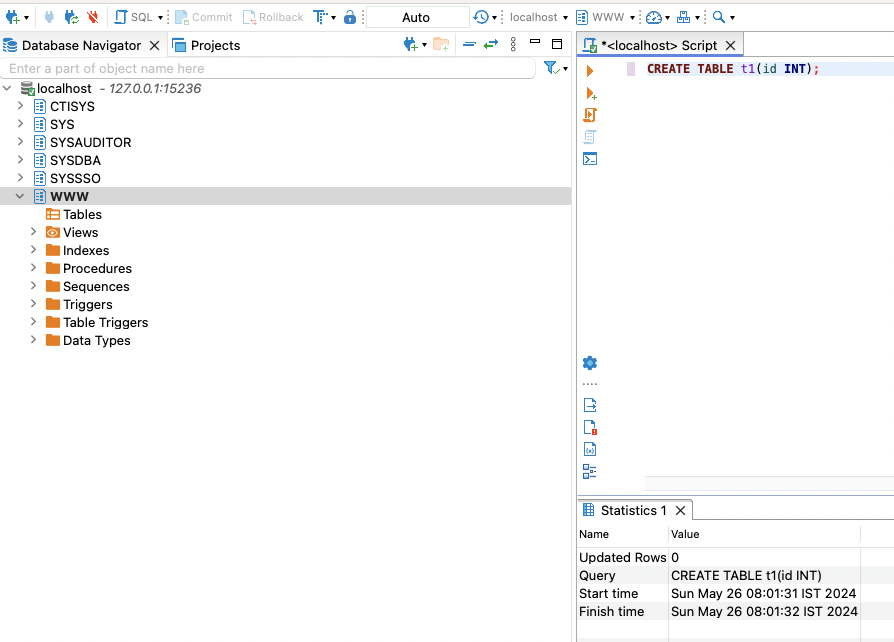
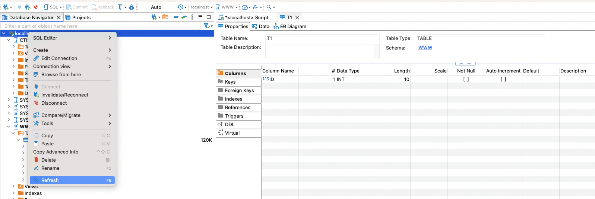

# DM8

## Start service

```bash
$ cd ~/tmp
$ ~/workspace/saturn-xiv/palm/docker/dm8/start.sh 15236 # listen on 0.0.0.0:15236

> /opt/bin/DmServiceDMSERVER start
> /opt/bin/DmServiceDMSERVER stop
> /opt/bin/DmServiceDMSERVER status
```

## Usage

```bash
$ cd /opt/dmdbms/bin/
$ ./disql # user: sysdba password: 123456789

SQL> SELECT * FROM V$VERSION;
SQL> SELECT SVR_VERSION, DB_VERSION, START_TIME, BUILD_TIME, BUILD_VERSION FROM V$INSTANCE;
SQL> SELECT EXPIRED_DATE FROM V$LICENSE;
```

- create user

```sql
-- create tablespace "demo" 10G
CREATE TABLESPACE "demo" DATAFILE '/var/lib/dm8/demo.dbf' SIZE 10240;

-- username: www password(at least 9 characters，MUST include upper/lower letters、 numbers、special symbols): change-ME@2024
CREATE USER "www" IDENTIFIED BY "change-ME@2024" HASH WITH SHA512 SALT ENCRYPT BY "123456" DEFAULT TABLESPACE "demo" DEFAULT INDEX TABLESPACE "demo";
GRANT "DBA" TO "www";
```





## DBeaver

- Add the jdbc driver





- Create a connection





- Test the connection



